# Project 5: Targeting Covid Remediation
### By: Amanda Khairunnisa, Jennifer Fong, Sam Lindy (DSIR-Nightingale)

## Problem Statement
We are a team of data scientists who have been hired by a private national aid organization to identify and assist counties that are being hit hard by COVID-19. Though the CDC’s dataset is comprehensive, there is a high degree of uncertainty when forecasting the spread of the virus. By conducting an independent audit of this data, we aim to improve this assessment model and provide geovisualization tools, so resources can be directed to areas of need more quickly than has previously been possible.

## Data Source(s):
- [CDC Data](https://beta.healthdata.gov/Health/COVID-19-Community-Profile-Report/gqxm-d9w9) - Dictionary: [cdc data](./doc/cdc_data_dictionary.md)
- [John Hopkins Covid Data](https://coronavirus.jhu.edu/about/how-to-use-our-data)
- [Google Mobility Data](https://www.google.com/covid19/mobility/) - Overview: [link](https://support.google.com/covid19-mobility/answer/9824897?hl=en&ref_topic=9822927)
- [OxCGRT US Regulation Data](https://github.com/OxCGRT/USA-covid-policy) - Dictionary: [link](https://github.com/OxCGRT/covid-policy-tracker/blob/master/documentation/codebook.md)
- [Unemployment Data](https://www.bls.gov/lau/#cntyaa)

## Table of Content
1. ETL
- [a10_etl_cdc]()
- [a10_etl_combo](./code/a10_etl_combo.ipynb): extraction and cleaning of additional datasets (i.e. John Hopkins, Google Mobility, OxGRT US Regulation and Unemployment Data), and combining and transforming all datasets into one.  

2. EDA
- [a20_eda_jh](a20_eda_jh_covid_eda.ipynb): time-series analysis of spread of COVID at national, state, and city level
- [a20_eda_jh](./code/a20_eda_jh_map_gif.ipynb): time-lapse of the spread of COVID by county
- [a20_eda_jh](./code/a20_eda_jh_covid_map.ipynb): exploratory analysis with geovisualization graphs on confirmed cases, death per million, and growth by 100k, all by county
- [a20_eda_social_impact](./code/a20_eda_social_impact.ipynb): exploratory data analysis on mobility, regulation and unemployment data.

3. Model
- [a30_model_rnn_model](./code/a30_model_rnn_model.ipynb): fitting county level data onto RNN models.
- [a30_model_rnn_eval](./code/a30_model_rnn_eval.ipynb): evaluation of 3,000+ RNN models.
- [a30_model_logreg_model](./code/a30_model_logreg_combined_datasets.ipynb) fitting county data on logistic regression
- [a30_model_nn simple model](./code/a30_model_nn_simple_gcolab.ipynb) fitting county data on simple neural network

## Executive Summary

### Context

As we all experienced, pandemics can spread with alarming speed and can be difficult to track.  Creating tools that monitor the virus and understanding which factors are either decreasing or increasing cases and death are key to saving lives and helping areas in need.  

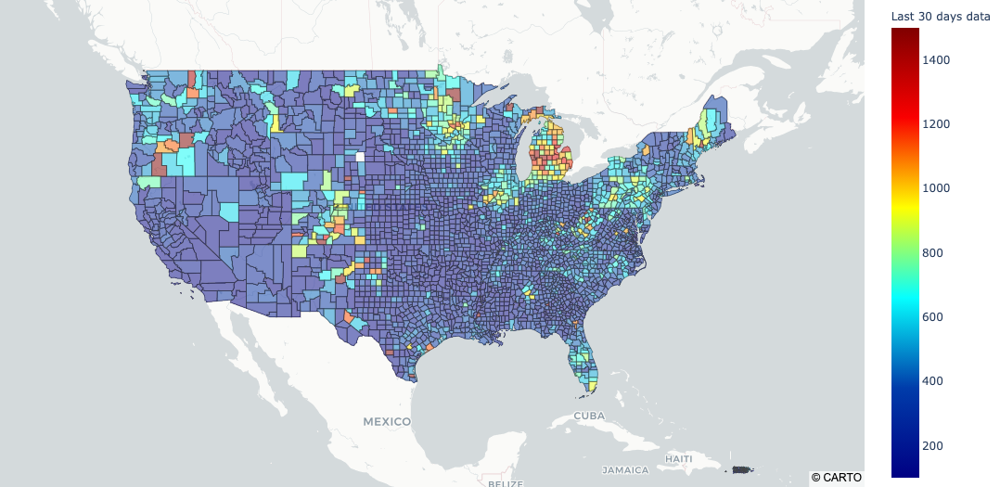

Looking at the confirmed cases in the last 30 days, we can see that the majority of the country reported relatively low numbers of new cases, with the notable exception of an outbreak in Michigan. Aside from that, the counties with cases of ~600 and above are occuring mostly in rural communities.

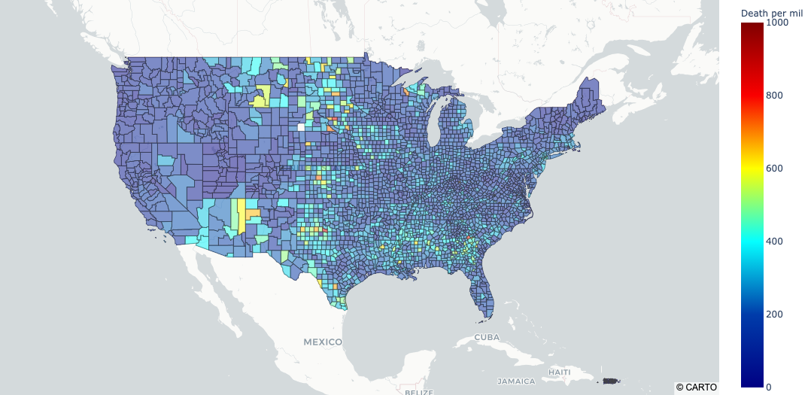

Similar to the graph above, deaths per million by county are higher in rural communites than they are in urban areas.

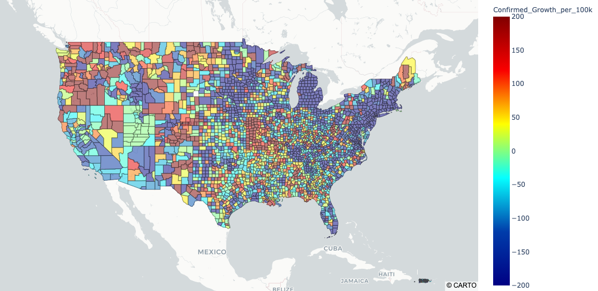

As of a month ago, growth was occuring in mostly rural counties with hotspots emerging in Missouri, Colorado, and the Pacific Northwest. The main takeaway from these three plots is that rural communities are more likely to have more confirmed cases, more deaths, and more growth than more populated counties. 
### Verification

As noted with a visual examination of the CDC published excel spreadsheets, most counties were forecast with a case trajectory of 'Uncertain'.  Part of the effort in targeting Covid relief is to see if the forecast can be improved to reduce that uncertainty.

From the County data published reports (1/02/2021-4/30/2021), a baseline of uncertainty was ~89%

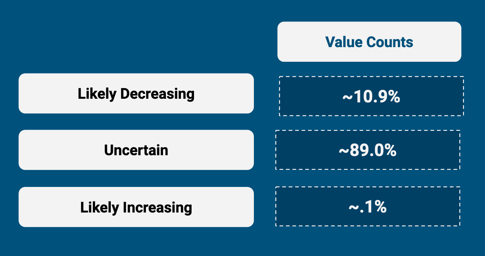

As part of the effort to work with the class imbalance, logistic regression was run with SMOTE applied to the dataset and separately class weight balancing was also attempted.  The results are documented under the modeling section.  Without these efforts to work around the imbalance, the resulting logistic regression model would predict ~99.7% the majority class.

The SMOTE based model was used to create predictions to better understand the difference feature correlation differences between the CDC predictions and the model predictions.

The X test SMOTE dataset was concatenated with the y test and prediction variables to see how feature correlation compared in influencing the logistic regression models.
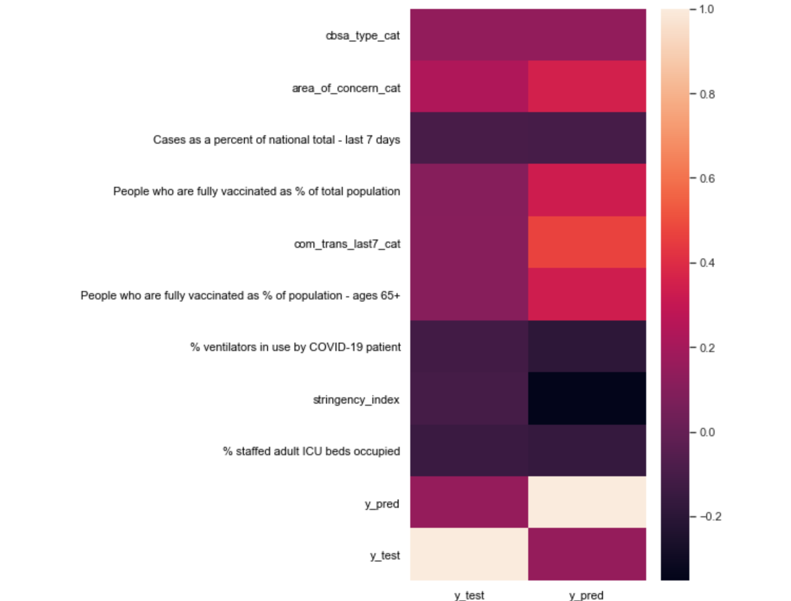

From the correlated CDC dataset features above, we can see that there are some unexpected relationships with how this forecast is reached.  Features such as CBSA type remain consistent over time, so it is not clear why this would indicate an increase or decrease in cases over time.  Some features which did represent changes over time, such as percent changes in deaths or cases, were shown as not closely related.  From CDC feature names, it can be seen that the CDC wasn't always getting data in a timely manner which may have contributed to the uncertainty.

### Social Impact

**Mobility**

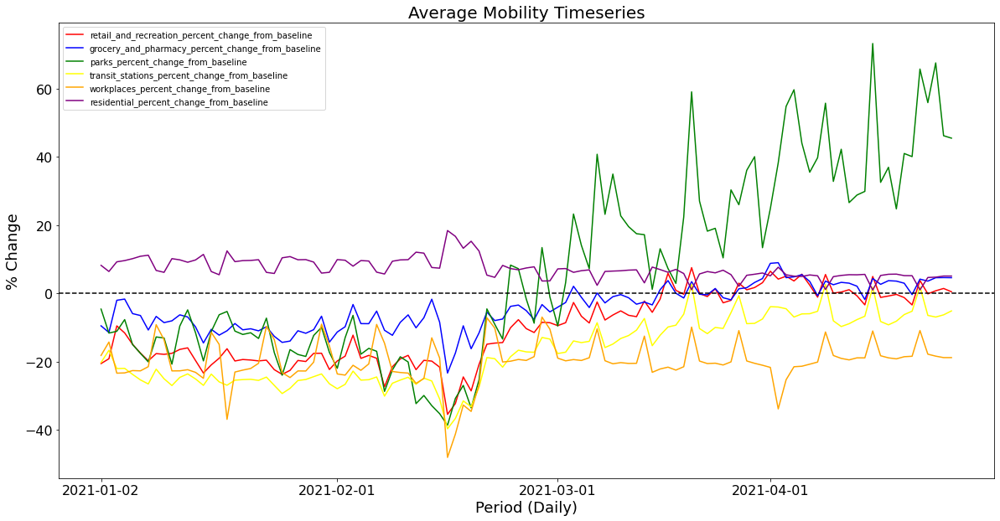

Looking at the graph above, we can see that aside from mobility within residential areas, most locations' % change in mobility vs baseline (baseline being pre-covid numbers) are negative. However, with vaccine roll outs in 2021, an upward trend in mobility can be observed - especially for areas like parks, followed by retail and recreation, and groceries and pharmacies. This may be due to less social distancing regulations which allow for people to hangout in public, open-air spaces. Relative to other areas, transit stations' and workplace mobility is still below baseline numbers being that people are mostly still working from home. 

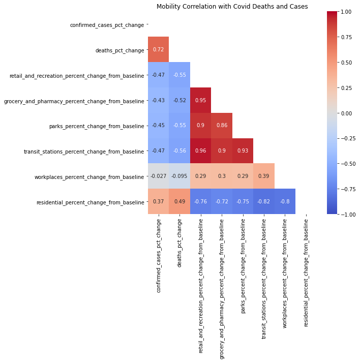

In the heatmap above, we can see a strong negative correlation between mobility in public areas and the numbers of covid cases and deaths. The intersections of our four mobility categories and two covid metrics show these relationships (highlighted in blue). What this means is that as cases rise, people are more likely to stay close to home. The reverse is also true - as the virus slows, we’re seeing the public embrace a “new normal,” returning to the public areas classified in our four categories.

**Regulation**

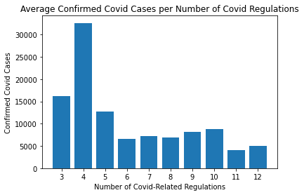

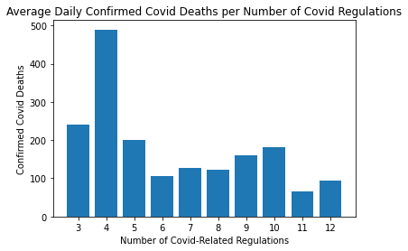

Although it may seem like more regulations result in relatively less confirmed cases and deaths, it must be noted that correlation does not always equal causation. As seen above, average daily cases and deaths seem to spike for counties with 4 regulations than those with less, this may be due to the fact that more covid cases and deaths also bring about stricter regulations.

**Unemployment**

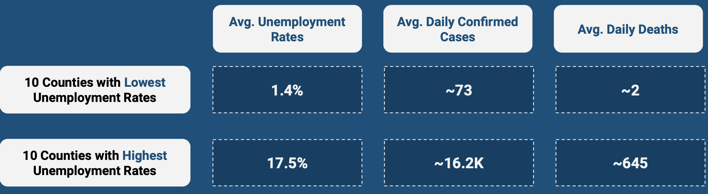

Looking at the numbers above, counties with higher average daily confirmed cases and deaths have higher unemployment rates which may be a result of their economy being hit harder by the pandemic, and vice-versa.

### Model Evaluation

**Logistic Regression**

A number of variations were run
* plain lbfgs solver  with .889 accuracy however this is closer to the baseline and barely predicted the smallest minority class.
* SMOTE with lbfgs solver
* balanced with lbfgs solver (this had lower accuracy that SMOTE)

**Random Forest**

A simple random forest was run for an early look into feature importance.  This was not pursued further because we were unable to run a cross validation to tune it.

It would run for several hours without completing.

**Neural Networks**

A simple neural network was run for early examination of the data.  Accuracy was around .899 and stayed close to the baseline. 

**Recurrent Neural Network**

The RNN model is 85% accurate - which is lower than the baseline by ~4%. It is however, very interesting how the predictions are able to predict less of the majority class by ~9%, yet at the same time a lot that was classified within the minority classes are allocated as "uncertain" instead. To deep dive further we can look at counties which had the least accurate predictions based on their last date (2021-03-30) category.

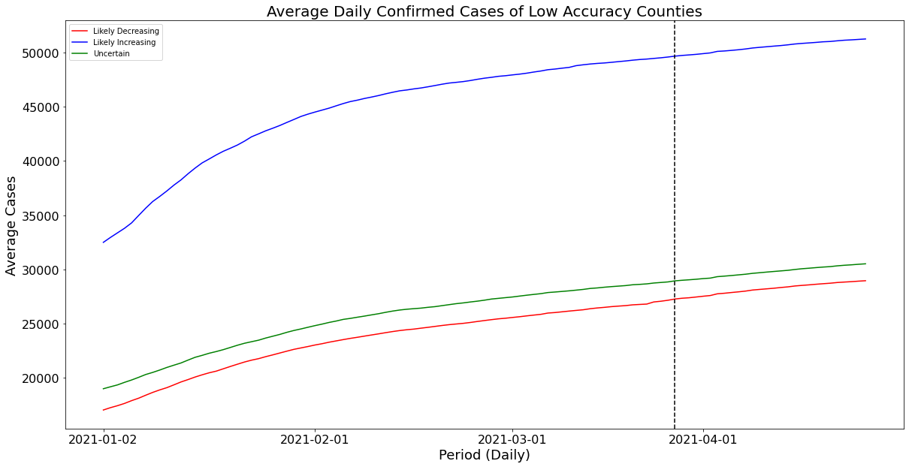

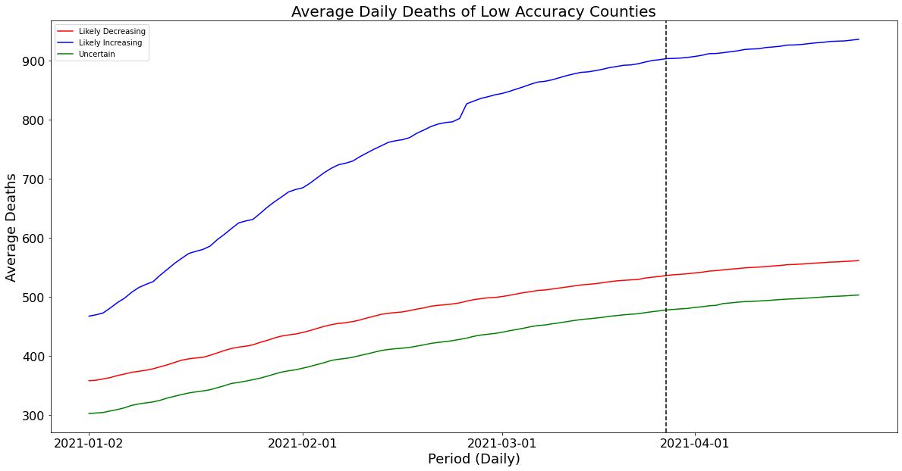

When looking at average daily confirmed cases and deaths, we can see that counties considered to be likely increasing have significantly larger numbers than that categorized as likely decreasing or uncertain. Although uncertain counties have more confirmed cases, they have less deaths when compared to those categorized as likely decreasing. Average numbers in all cases seem to show an increase day-to-day - for further iterations it would be interesting to engineer features in relation to cases and deaths using pct_change() and diff() to see how it would impact the classification. 

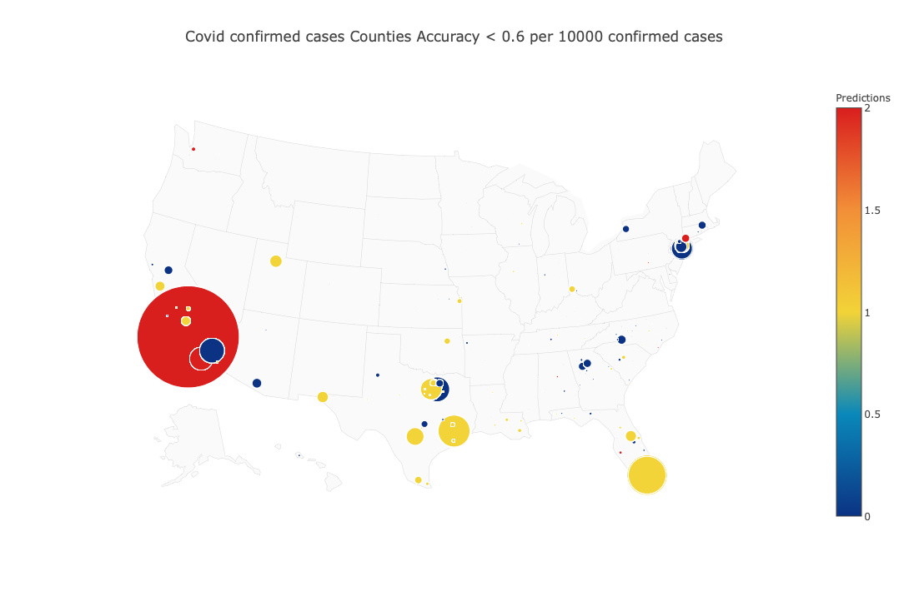

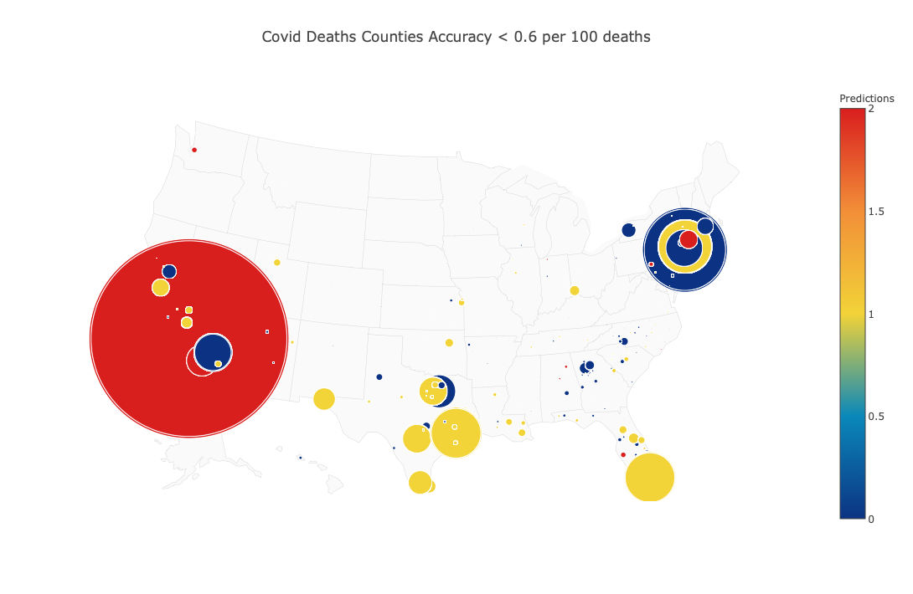

Counties considered likely increasing with relatively high numbers of cases and deaths:
- Los Angeles
- San Diego

Counties considered uncertain with relatively high numbers of cases and deaths:
- Miami
- Bronx County
- Harris County
- Tarrant County
- Bexar County

Counties considered likely decreasing with relatively high numbers of cases and deaths:
- New York
- Queens
- Riverside County

*Note: When the graphs are unweighted, more counties can be seen, in which 22% are non-core (likely rural counties), 21% are Medium Metro, 20% are Micropolitan, 16% are Large Fringe Metro, 13% are Small Metro and 8% are Large Central Metro.*

*Recommendations*

Aside from adjusting features as mentioned above, it may be of value to create a model on only likely decreasing and likely increasing counties, which then can be used to predict categories for "uncertain" counties and see what inferential points we can pull from there. 

*Limitations*

Although it would also be nice to be able to get more inference from the model, due to the nature of RNN, we cannot really tell which features are significant in determining the categories of the counties. 

### Key Takeaways
- Covid has really impacted society from a mobility standpoint, and with the rollout of vaccines in late-Feb / early-March we can see the the public starting to "embrace" the "new normal"
- As for regulations, there seem to be a strong correlation between the number of regulations and covid cases and deaths - however there is the chicken-and-egg dilemma when it comes to causation
- Rural areas continue to experience increases in Covid vs their city counterparts
- Government uncertainty is linked to data delays
- John Hopkins academic data provided more certainty and greater re-use
    - More narrow focus, but consistent reporting
- Government data is not geared towards public re-use
    - Format not accessible
    - Bias behind decisions not clear

### Conclusion and Recommendations
- Live dashboards which could help client
- Timely information improvement
- Centralized, federally controlled data warehouse + tool
- Public information should be accessible and easily digestible
